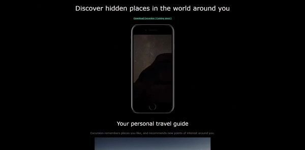

## Mobile Application Website
<h4>Visualization of the Website</h4>
<br>
<p align="center">

</p>
<hr>
<b>Check The Live Website ➡️</b> <a href="https://github.com/BAVI-BOOP/SQL-projects/blob/main/chinook-data/main.sql">Queries</a>
<hr>
<h3>Overview🎵</h3>
In this project I mastered division and professional photo and video mixture.We used HTML and CSS. You can see visual representation of the website above. W
<hr>
<h3>Project Skeleton</h3>
  
```
|-- SQL-projects
    |-- resources
        |-- css
            |-- style.css
        |-- images
            |-- camp.jpg
            |-- phone.png
        |-- videos
            |-- excursion.mp4
        |-- main.sql
    |-- index.html
    |-- excursion.gif
    |-- README.md
```    
<hr>
<h3>Used in this project</h3>

👉HTML tags, Comments, CSS styling, Positioning,etc.


<hr>
<h3>How to Use the Project</h3>
<span>First download : </span><a href='https://sqlitebrowser.org/dl/'>DB Browser for SQLite</a>
<br><span>Second open this database : </span><a href='https://github.com/BAVI-BOOP/SQL-projects/blob/main/chinook-data/chinook.db'>Chinook Database</a>
<br><span>You can use this tutorial : </span><a href='https://www.youtube.com/watch?v=byHcYRpMgI4'>SQLite tutorial</a>
