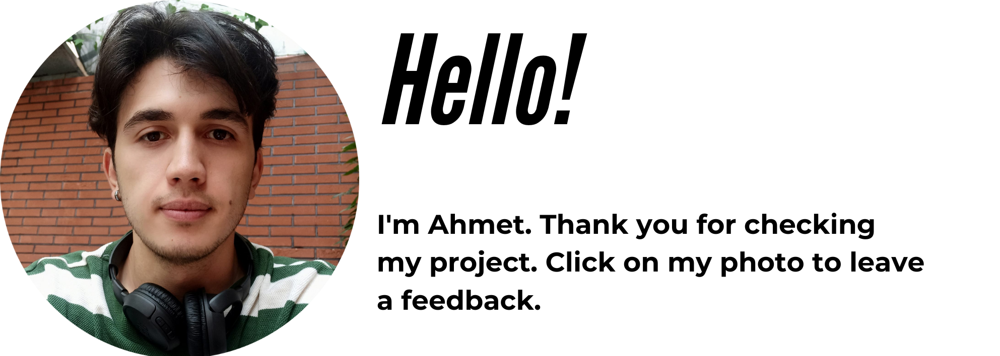

<p align="center">
<a href="https://www.linkedin.com/in/ahmet-ayd%C4%B1n-2583b1199/" target="_blank"></a>
</p>


# Mobile Application Website

## Table of contents

  - [Overview](#overview)
  - [Screenshot](#screenshot)
  - [Project Skeleton](#project-skeleton)
  - [Links](#links)
  - [Built with](#built-with)
  - [How to use the project](#How-to-use-the-project)
  - [Useful resources](#useful-resources)
- [Author](#author)

## Overview
In this project I mastered division and professional photo and video mixture.We used HTML and CSS. You can see visual representation of the website above.

## Screenshot
<p align="center">
<a href="https://bavi-boop.github.io/excursion-website/"></a>
</p>

## Project Skeleton
  
```
|-- Excursion-website(folder)
    |-- resources(folder)
        |-- css
            |-- style.css
        |-- images
            |-- camp.jpg
            |-- phone.png
        |-- videos
            |-- excursion.mp4
    |-- index.html
    |-- excursion.gif
    |-- README.md
```    

## Links
<b>Check The Live Website ➡️</b> <a href="https://bavi-boop.github.io/excursion-website/">Live Website</a>
<br>

### Built with

- Semantic HTML5 markup
- CSS custom properties
- Flexbox
- CSS Grid
- Mobile-first workflow

- [Styled Components](https://styled-components.com/) - For styles
	
- HTML Forms-Input Types 

- HTML Form Elements

- CSS Colors-Border Properties

- CSS Margins-Padding

- CSS Properties for Texts-Font Families-Links


-

## Notes

- You can use HTML,and CSS to complete this project.


## How to use the project
<span>First download a code editor </span>
<br><span>Second open the files : </span><a href='https://github.com/BAVI-BOOP/excursion-website'>My Docs</a>
<br><span>You can use this tutorial : </span><a href='https://www.youtube.com/watch?v=fJEbVCrEMSE'>VS Code tutorial</a>


### Useful resources

- [W3 Schoold](https://www.w3schools.com/) - This helped me for basics of website paradigm. I really liked this pattern and will use it going forward.
- [MDN](https://developer.mozilla.org/en-US/) - This is an amazing document which helped me finally understand deep sides of web development. I'd recommend it to anyone still learning these concepts.
- [Codecademy](https://www.codecademy.com/learn) - This project was assigned by codecademy platform.


## Author

- Author - [Ahmet]

<center> &#8987; Happy Coding  &#9997; </center>

